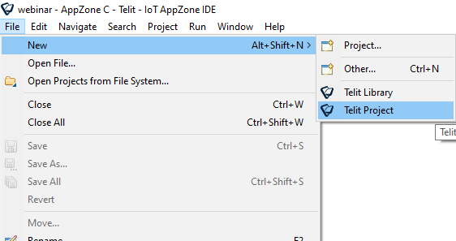
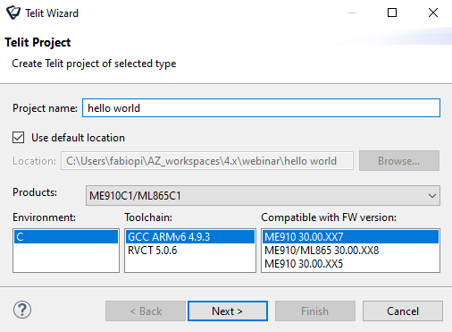
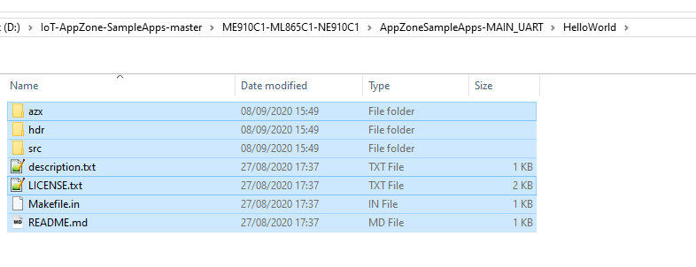
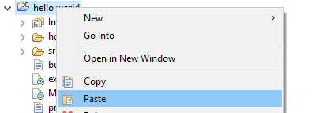
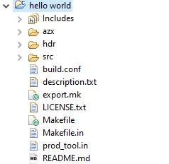

# IoT-AppZone-SampleApps
Telit IoT AppZone Sample Apps - unleash the power of m2mb common abstraction layer

## Abstract

This repository contains Telit IoT AppZone C sample apps, which help users quicken their projects development.

## Structure

Each module family has its own subfolder, containing all the sample apps available for that family. Please Refer to the subfolders README.md for further details

  - [ME910C1-ML865C1-NE910C1](ME910C1-ML865C1-NE910C1): Samples supported from 30.00.xx8 firmware version
  - [ME310G1-ME910G1-ML865G1](ME310G1-ME910G1-ML865G1): Samples supported from 37.00.xx1 firmware version

## Usage

The master branch will always contain the latest sample apps package version. Older ones will be available through tags.

To use a specific sample app, first download the repository content by pressing the green button "Code" and selecting "Download ZIP".

**Please note: the repository can always be locally cloned using git tools. In the following description, the downloaded zip approach will be considered.**

Once downloaded, uncompress `IoT-AppZone-SampleApps-master.zip` file.

Let's say that the **HelloWorld** sample app on Main UART is needed for ME910C1 family. Its path inside the repository will be `ME910C1-ML865C1-NE910C1/AppZoneSampleApps-MAIN_UART/HelloWorld/`.

To use it, from the AppZone IDE create a new Telit Project

Select the ME910C1 products family, the ToolChain (for example, GCC) and the required firmware version, then press **Next >**.

In the next window, leave "Empty Project" as project type, then press **Finish** button.

In the IDE Project Explorer, the newly created project will be available:

As last step, go into the repository local copy (either cloned via git or downloaded as a zip file), in this case `ME910C1-ML865C1-NE910C1/AppZoneSampleApps-MAIN_UART/HelloWorld/`. Select all files and folders

then copy and paste them in the project from the IDE:

The IDE will ask the permission to overwrite existing files, press **"Yes to All"**.

Done! The project is now updated with the latest sample app source code available, and is ready to be built.

---

For further info, please go on Telit's cellular modules product webpage https://www.telit.com/m2m-iot-products/cellular-modules/standard-industrial-grade/

AppZone development resources are available at the link https://www.telit.com/developer-zone/iot-app-zone/iot-app-zone-developer-resources/

